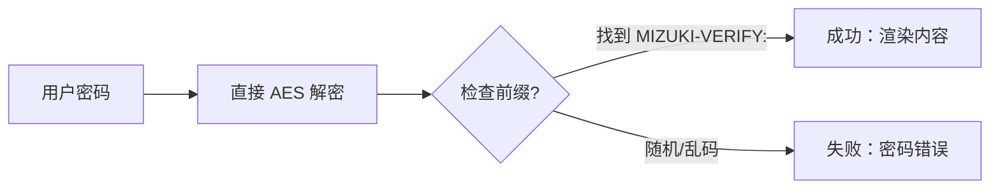

这个博客模板是用 [Astro](https://astro.build/) 构建的。对于本指南中未提及的内容，你可以在 [Astro 文档](https://docs.astro.build/)中找到答案。

## 文章的 Front-matter

```yaml
---
title: 我的第一篇博客文章
published: 2023-09-09
description: 这是我新 Astro 博客的第一篇文章。
image: ./cover.jpg
tags: [Foo, Bar]
category: 前端
draft: false
---
```


| 属性     | 描述                                                                                                                                                                                                 |
|---------------|-------------------------------------------------------------------------------------------------------------------------------------------------------------------------------------------------------------|
| `title`       | 文章标题。                                                                                                                                                                                      |
| `published`   | 文章发布日期。                                                                                                                                                                            |
| `pinned`      | 此文章是否置顶到文章列表顶部。                                                                                                                                                   |
| `description` | 文章简短描述。显示在索引页面。                                                                                                                                                   |
| `image`       | 文章封面图片路径。<br/>1. 以 `http://` 或 `https://` 开头：使用网络图片<br/>2. 以 `/` 开头：使用 `public` 目录中的图片<br/>3. 不带前缀：相对于 markdown 文件的路径 |
| `tags`        | 文章标签。                                                                                                                                                                                       |
| `category`    | 文章分类。                                                                                                                                                                                   |
| `alias`   | 文章别名。文章可通过 `/posts/{alias}/` 访问。例如：`my-special-article`（将可在 `/posts/my-special-article/` 访问）                                   |
| `licenseName` | 文章内容的许可协议名称。                                                                                                                                                                      |
| `author`      | 文章作者。                                                                                                                                                                                     |
| `sourceLink`  | 文章内容的来源链接或参考。                                                                                                                                                          |
| `draft`       | 此文章是否仍是草稿，草稿不会显示。                                                                                                                                                    |
| `encrypted`   | 此文章是否需要密码保护。                                                                                                                                                                    |
| `password`    | 解锁加密文章的密码。                                                                                                                                                                  |
| `passwordHint`| 帮助用户记住密码的提示。显示在密码输入框下方。                                                                                                                             |
| `hideHomeContent` | 是否隐藏公开文章摘要，包括首页、meta 标签、feed/API 摘要和分享预览。当设置 `password` 时默认为 `true`。                                      |

## 文章文件放在哪里


你的文章文件应该放在 `src/content/posts/` 目录中。你也可以创建子目录来更好地组织你的文章和资源。

```
src/content/posts/
├── post-1.md
└── post-2/
    ├── cover.png
    └── index.md
```

## 文章别名

你可以通过在 front-matter 中添加 `alias` 字段为任何文章设置别名：

```yaml
---
title: 我的特殊文章
published: 2024-01-15
alias: "my-special-article"
tags: ["示例"]
category: "技术"
---
```

当设置别名时：
- 文章可通过自定义 URL 访问（例如：`/posts/my-special-article/`）
- 默认的 `/posts/{slug}/` URL 仍然可用
- RSS/Atom feed 将使用自定义别名
- 所有内部链接将自动使用自定义别名

**重要提示：**
- 别名不应包含 `/posts/` 前缀（会自动添加）
- 避免在别名中使用特殊字符和空格
- 使用小写字母和连字符以获得最佳 SEO 效果
- 确保别名在所有文章中是唯一的
- 不要包含前导或尾随斜杠


## 工作原理



## 页面加密

你可以通过在 front-matter 中设置 `encrypted: true` 并提供 `password` 来为任何文章设置密码保护：

```yaml
---
title: 我的私密文章
published: 2024-01-15
encrypted: true
password: "my-secret-password"
passwordHint: "提示：密码是我狗狗的名字"
hideHomeContent: true
---
```

### 字段说明

| 字段          | 必需 | 描述                                              |
|----------------|----------|----------------------------------------------------------|
| `encrypted`    | 是      | 设置为 `true` 启用密码保护              |
| `password`     | 是      | 解锁文章的密码                          |
| `passwordHint` | 否       | 显示在密码输入框下方的提示，帮助用户 |
| `hideHomeContent` | 否   | 将公开摘要隐藏为 `该文章已加密`。当设置 `password` 时默认为 `true`。设置为 `false` 可显示正常摘要。 |

### 解锁框的样式

解锁框显示：
- 主题主色调的锁图标
- 文章标题 "密码保护"
- 要求输入密码的描述
- 提示（如果提供了 `passwordHint`）
- 密码输入框和解锁按钮

输入正确密码后，内容将被解密并显示。密码存储在 session storage 中，因此用户在同一会话中后续页面加载时无需重新输入。
