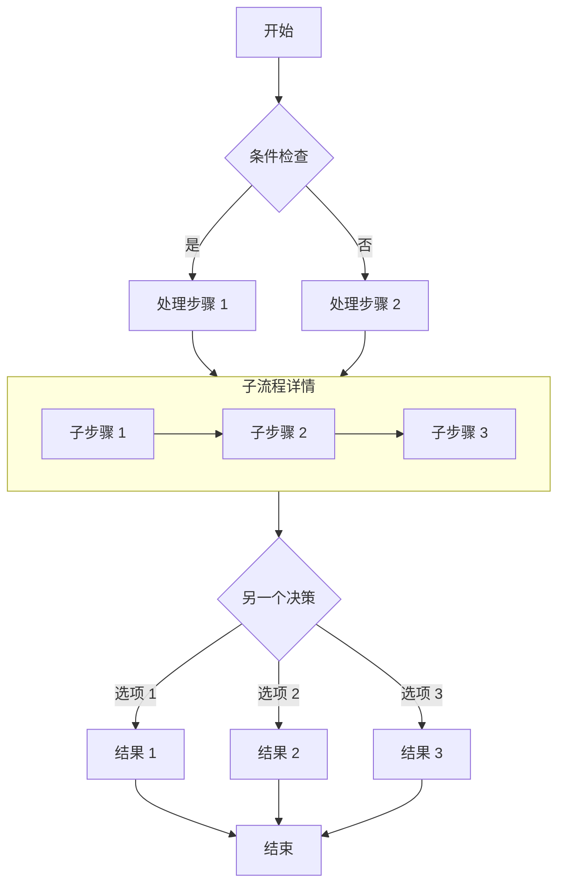
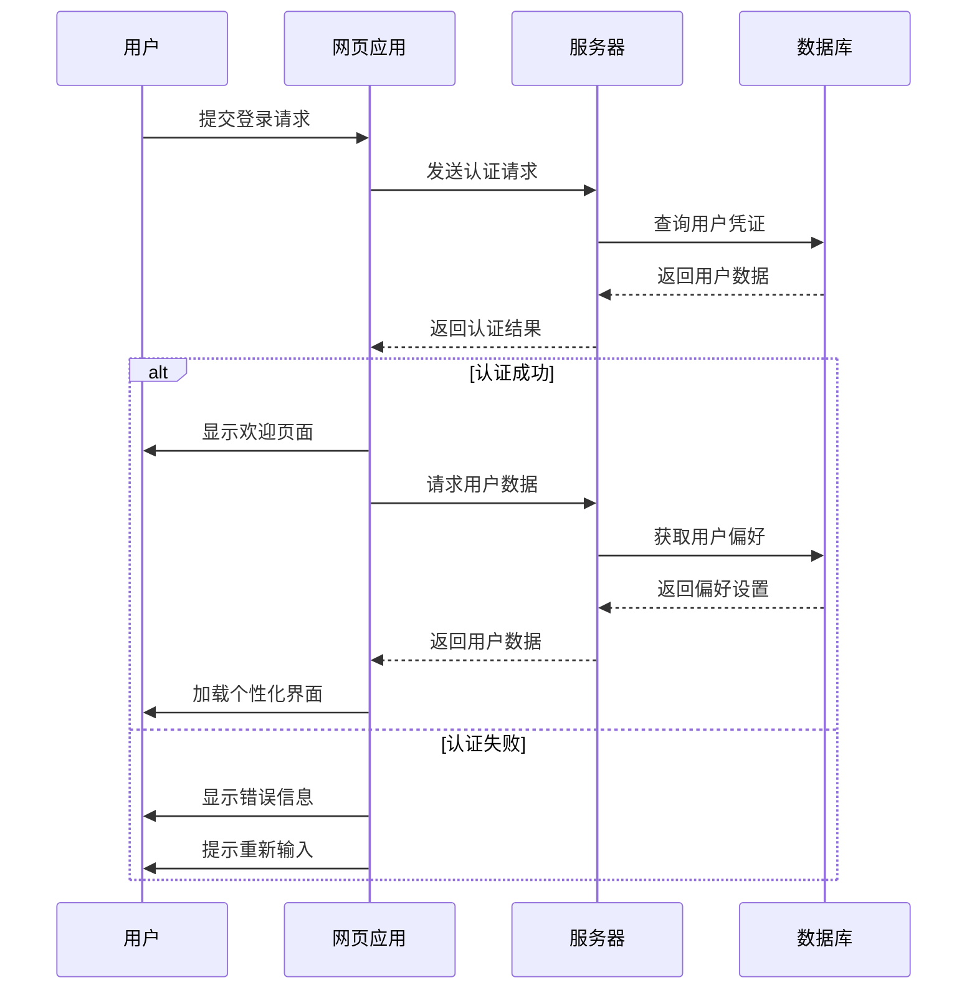
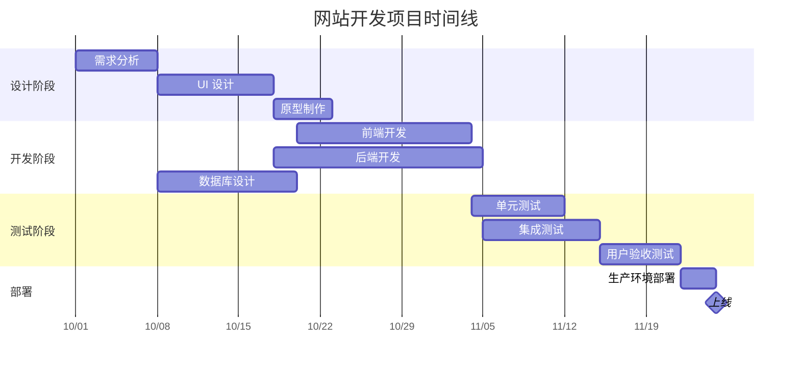
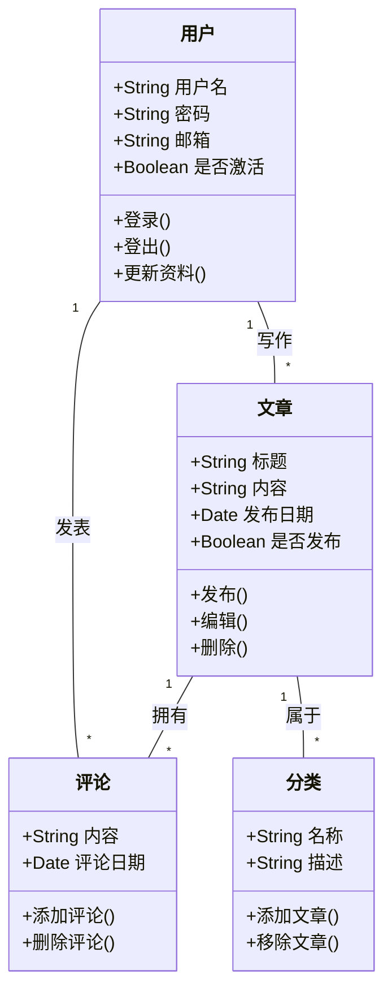
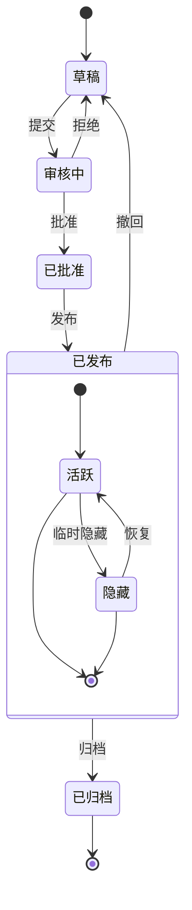
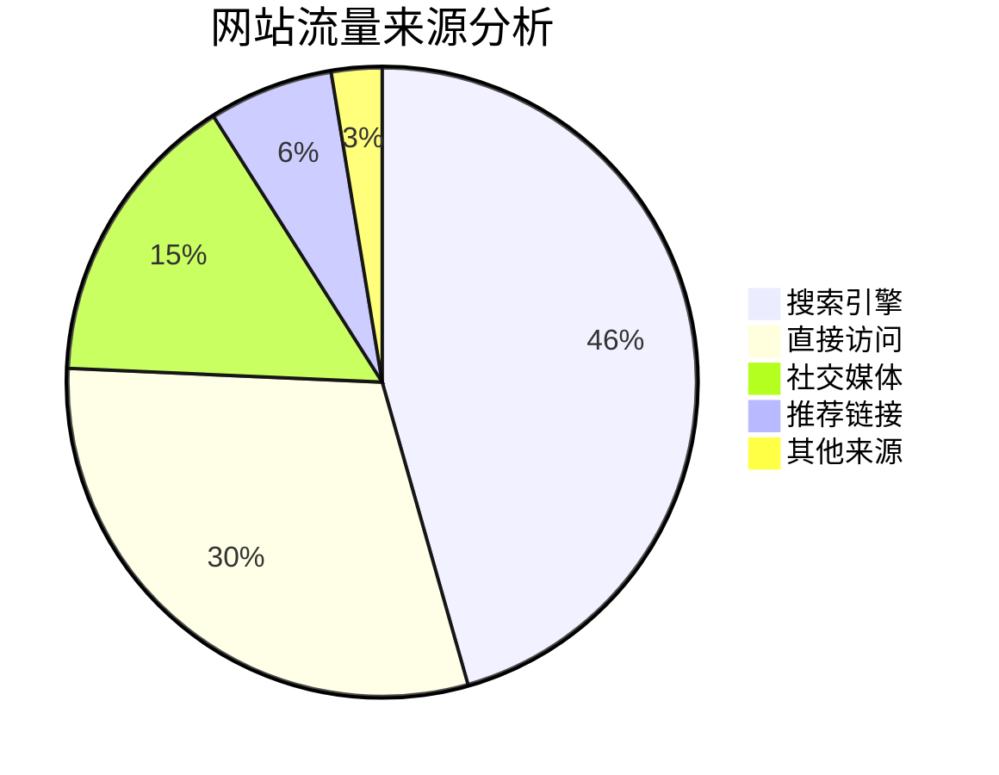

# Markdown 与 Mermaid 图表完整指南

本文演示如何在 Markdown 文档中使用 Mermaid 创建各种复杂的图表，包括流程图、序列图、甘特图、类图和状态图。

## 流程图示例

流程图非常适合表示流程或算法步骤。

## 序列图示例

序列图显示对象之间随时间的交互。

## 甘特图示例

甘特图非常适合显示项目进度和时间表。

## 类图示例

类图显示系统的静态结构，包括类、属性、方法及其关系。

## 状态图示例

状态图显示对象在其生命周期中经历的状态序列。

## 饼图示例

饼图非常适合显示比例和百分比数据。

## 总结

Mermaid 是一个在 Markdown 文档中创建各种图表的强大工具。本文演示了如何使用流程图、序列图、甘特图、类图、状态图和饼图。这些图表可以帮助你更清晰地表达复杂的概念、流程和数据结构。

要使用 Mermaid，只需在代码块中指定 mermaid 语言，并使用简洁的文本语法描述图表。Mermaid 会自动将这些描述转换为美观的可视化图表。

在你的下一篇技术博客或项目文档中尝试使用 Mermaid 图表 - 它们会让你的内容更加专业且易于理解！
